# Gaussian process

$$
\yV = (y_1, \ldots, y_N), \quad \xM = (\xV_1, \ldots, \xV_N)^\top
$$
$$
p(\yV| \fV) = \gaussianDist{\yV}{\fV}{\sigma^2 \I}, \quad p (\fV| \xM) = \gaussianDist{\fV}{0}{\K(\xM, \xM)}
$$

{ width=50% }

# The computational time of GP

- The time complexity of Gaussian process is $O(N^3)$.

- Take 1D regression problem as an example:
    - The input and output dimensionality are both one.
    - We generate generate synthetic data.
    - Measure the time that it takes for computing the log-likelihood.

# Empirical analysis of computational time

- I collect the run time for $N = \{10, 100, 500, 1000, 1500, 2000\}$.
- They take 1.3ms, 8.5ms, 28ms, 0.12s, 0.29s, 0.76s.

{ width=50% }

# What if we have 1 million data points?

- The mean of predicted computational time is $9.4\times 10^7$ seconds $\approx$ $2.98$ years.

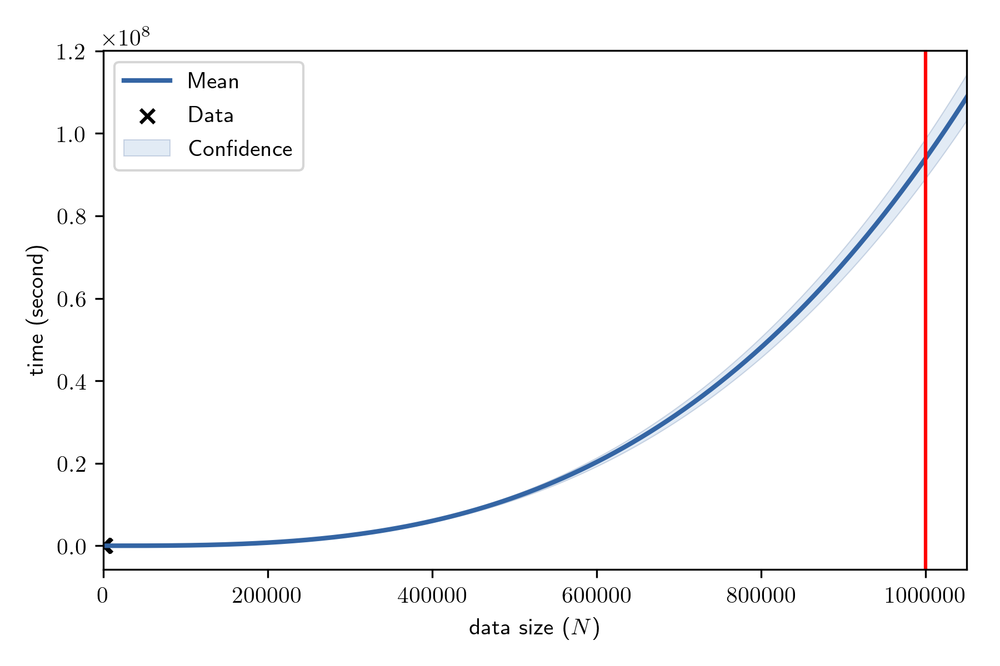{ width=50% }

# What about waiting for faster computers?

- Computational time  = $\frac{\text{amount of work}}{\text{computer speed}}$

- If the computer speed increase at the pace of 20% year over year:
    - After 10 years, it will take about 176 days.
    - After 50 years, it will take about 2.9 hours.

- If we double the size of data, it takes 11.4 years to catch up.

# What about parallel computing / GPU?

- Ongoing works about speeding up Cholesky decomposition with multi-core CPU or GPU.

- Main limitation: heavy communication and shared memory.

![[@Joao2016]](./diagrams/parallel_cholesky.png){ width=30% }

# Other approaches

- Apart from speeding up the exact computation, there have been a lot of works on approximation of GP inference.
- These methods often target at some specific scenario and provide good approximation for the targeted scenarios.
- Provide an overview about common approximations.

# Big data (?)

- lots of data $\neq$ complex function
- In real world problems, we often collect a lot of data for modeling relatively simple relations.

{ width=50% }

# Data subsampling?

- Real data often do not evenly distributed.
- We tend to get a lot of data on common cases and very few data on rare cases.

{ width=45% }
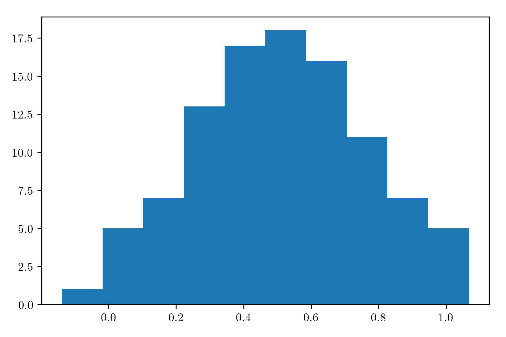{ width=45% }

# Covariance matrix of redundant data

- With redundant data, the covariance matrix becomes low rank.
- What about low rank approximation?

{ width=33% }
{ width=45% }

# Low-rank approximation

- Let's recall the log-likelihood of GP:
$$
\log p(\yV|\xM) =  \log \gaussianDist{\yV}{0}{\K+\sigma^2\I},
$$
where $\K$ is the covariance matrix computed from $\xM$ according to the kernel function $k(\cdot, \cdot)$ and $\sigma^2$ is the variance of the Gaussian noise distribution.
- Assume $\K$ to be low rank.
- This leads to Nyström approximation by Williams and Seeger [-@WilliamsSeeger2001].

# Nyström approximation [@WilliamsSeeger2001]

- Let's randomly pick a subset from the training data: $\zM \in \R^{M\times Q}$.
- Approximate the covariance matrix $\K$ by $\tilde{\K}$:
$$\tilde{\K} = \K_z \K_{zz}^{-1} \K_z^\top,$$
where $\K_{z} = \K(\xM, \zM)$ and $\K_{zz} = \K(\zM, \zM)$.

- Note that $\tilde{\K} \in \R^{N\times N}$, $\K_{z} \in \R^{N\times M}$ and $\K_{zz} \in \R^{M \times M}$.
- The log-likelihood is approximated by

$$
\log p(\yV|\xM, \theta) \approx  \log \gaussianDist{\yV}{0}{\K_z \K_{zz}^{-1} \K_z^\top+\sigma^2\I}.
$$

# Efficient computation using Woodbury formula

- The naive formulation does not bring any computational benefits.
$$
\tilde{\bound} = -\frac{1}{2}\log |2\pi (\tilde{\K}+\sigma^2\I)| - \frac{1}{2} \yV^\top (\tilde{\K}+\sigma^2\I)^{-1} \yV
$$
- Apply the Woodbury formula:
$$
(\K_z \K_{zz}^{-1} \K_z^\top+\sigma^2\I)^{-1} = \sigma^{-2}\I - \sigma^{-4} \K_z (\K_{zz} + \sigma^{-2}\K_z^\top\K_z)^{-1}\K_z^\top
$$
- Note that $(\K_{zz} + \sigma^{-2}\K_z^\top\K_z) \in \R^{M \times M}$.
- The computational complexity reduces to $O(NM^2)$.

<!--
# What is this different from data subsampling?

- The model parameters can be optimized
-->

# Gaussian process with pseudo data (1)

- Snelson and Ghahramani [-@SnelsonZoubin2006] propose the idea of having pseudo data. This approach is later referred to as   Fully Independent Training Conditional (FITC).
- Augment the training data ($\xM$, $\yV$) with pseudo data $\uV$ at location $\zM$.
$$
p\left(\begin{bmatrix}
\yV \\ \uV \end{bmatrix}|\begin{bmatrix}
\xM \\ \zM \end{bmatrix} \right) = \gaussianDist{\begin{bmatrix}
\yV \\ \uV \end{bmatrix}}{0}{\begin{bmatrix}
\K_{ff}+\sigma^2\I & \K_{fu}  \\ \K_{fu}^\top & \K_{uu} \end{bmatrix}}
$$
where $\K_{ff} = \K(\xM, \xM)$, $\K_{fu} = \K(\xM, \zM)$ and $\K_{uu} = \K(\zM, \zM)$.

# Gaussian process with pseudo data (2)

- Thanks to the marginalization property of Gaussian distribution,
$$
p(\yV| \xM) = \int_{\uV} p(\yV, \uV | \xM, \zM).
$$
- Further re-arrange the notation:
$$
p(\yV, \uV| \xM, \zM) = p(\yV| \uV, \xM, \zM) p(\uV| \zM)
$$
where $p(\uV| \zM) = \gaussianDist{\uV}{0}{\K_{uu}}$,
$p(\yV| \uV, \xM, \zM)=\gaussianDist{\yV}{\K_{fu} \K_{uu}^{-1} \uV}{\K_{ff} - \K_{fu} \K_{uu}^{-1} \K_{fu}^\top+\sigma^2\I}$.

# FITC approximation (1)

- So far, $p(\yV | \xM)$ has not been changed, but there is no speed-up, $\K_{ff} \in \R^{N\times N}$ in $\K_{ff} - \K_{fu} \K_{uu}^{-1} \K_{fu}^\top+\sigma^2\I$.

- The FITC approximation assumes
$$
\tilde{p}(\yV| \uV, \xM, \zM)=\gaussianDist{\yV}{\K_{fu} \K_{uu}^{-1} \uV}{\lambdaM +\sigma^2\I},
$$
where $\lambdaM = (\K_{ff} - \K_{fu} \K_{uu}^{-1} \K_{fu}^\top)\circ \I$.

# FITC approximation (2)

- Marginalize $\uV$ from the model definition:
$$
\tilde{p}(\yV| \xM, \zM) = \gaussianDist{\yV}{0}{\K_{fu} \K_{uu}^{-1} \K_{fu}^\top+\lambdaM +\sigma^2\I}
$$

- Woodbury formula can be applied in the sam way as in Nyström approximation:
$$
(\K_z \K_{zz}^{-1} \K_z^\top+\lambdaM+\sigma^2\I)^{-1} = \aM - \aM \K_z (\K_{zz} + \K_z^\top\aM\K_z)^{-1}\K_z^\top\aM,
$$
where $\aM = (\lambdaM+\sigma^2\I)^{-1}$.

# FITC approximation (3)

- FITC allows the pseudo data not being a subset of training data.
- The inducing inputs $\zM$ can be optimized via gradient optimization.
- Like Nyström approximation, when taking all the training data as inducing inputs, the FITC approximation is equivalent to the original GP:
$$
\tilde{p}(\yV| \xM, \zM=\xM) = \gaussianDist{\yV}{0}{\K_{ff} +\sigma^2\I}
$$
- FITC can be combined easily with expectation propagation (EP).
- [@BuiEtAl2017] provides an overview and a nice connection with variational sparse GP.

# Model Approximation vs. Approximate Inference

When the exact model/inference is intractable, typically there are two types of approaches:

- Approximate the original model with a simpler one such that inference becomes tractable, like Nyström approximation, FITC.
- Keep the original model but derive an approximate inference method which is often *not* able to return the true answer, like variational inference.

# Model Approximation vs. Approximate Inference

A problem with model approximation is that

- when an approximated model requires some tuning, e.g., for hyper-parameters, it is unclear how to improve it based on training data.

- In the case of FITC, we know the model is correct if $\zM = \xM$, however, optimizing $\zM$ will not necessarily lead to a better location.

- In fact, optimizing $\zM$ can lead to overfitting. [@QuinoneroRasmussen2005]

# Variational Sparse Gaussian Process (1)

- [@Titsias2009] introduces a variational approach for sparse GP.
- It follows the same concept of pseudo data:
$$
p(\yV| \xM) = \int_{\fV, \uV} p(\yV| \fV) p(\fV| \uV, \xM, \zM) p(\uV| \zM)
$$
where $p(\uV| \zM) = \gaussianDist{\uV}{0}{\K_{uu}}$,
$p(\yV| \uV, \xM, \zM)=\gaussianDist{\yV}{\K_{fu} \K_{uu}^{-1} \uV}{\K_{ff} - \K_{fu} \K_{uu}^{-1} \K_{fu}^\top+\sigma^2\I}$.

# Variational Sparse Gaussian Process (2)

- Instead of approximate the model, [@Titsias2009] derives a variational lower bound.

- Normally, a variational lower bound of a marginal likelihood, also known as evidence lower bound (ELBO), looks like
$$
\begin{aligned}
\log p(\yV | \xM) =& \log \int_{\fV, \uV} p(\yV | \fV) p(\fV| \uV, \xM, \zM) p(\uV | \zM) \\
\geq& \int_{\fV, \uV} q(\fV, \uV) \log \frac{p(\yV | \fV) p(\fV| \uV, \xM, \zM) p(\uV | \zM)}{q(\fV, \uV)}.
\end{aligned}
$$

# Special Variational Posterior

- [@Titsias2009] defines an unusual variational posterior:
$$
q(\fV, \uV) = p(\fV| \uV, \xM, \zM) q(\uV), \quad \text{where } q(\uV) = \gaussianDist{\uV}{\mu}{\Sigma}.
$$
- Plug it into the lower bound:
$$
\begin{aligned}
\bound =& \int_{\fV, \uV} p(\fV| \uV, \xM, \zM) q(\uV) \log \frac{p(\yV | \fV) p(\fV| \uV, \xM, \zM) p(\uV | \zM)}{p(\fV| \uV, \xM, \zM) q(\uV)} \\
=& \expectation{\log p(\yV | \fV)}_{p(\fV| \uV, \xM, \zM) q(\uV)} - \KL{q(\uV)}{p(\uV|\zM)}\\
=& \expectation{\log \gaussianDist{\yV}{\K_{fu}\K_{uu}^{-1}\uV}{\sigma^2\I}}_{q(\uV)} - \KL{q(\uV)}{p(\uV|\zM)}
\end{aligned}
$$

# Tighten the Bound

- Find the optimal parameters of $q(\uV)$:
$$
\mu^\ast, \Sigma^\ast = \argmax_{\mu, \Sigma} \bound(\mu, \Sigma).
$$
- Make the bound as tight as possible by plugging in $\mu^\ast$ and $\Sigma^\ast$:
$$
\bound = \log \gaussianDist{\yV}{0}{\K_{fu} \K_{uu}^{-1} \K_{fu}^\top+ \sigma^2\I} - \frac{1}{2\sigma^2}\tr{\K_{ff} - \K_{fu} \K_{uu}^{-1} \K_{fu}^\top}.
$$
- The overall complexity of the lower bound remains $O(NM^2)$.

# Variational sparse GP

- Note that $\bound$ is not a valid log-pdf, $\int_{\yV} \exp(\bound(\yV)) \leq 1$, due to the trace term.
- As inducing points are variational parameters, optimizing the inducing inputs $\zM$ always leads to a better bound.
- The model does not "overfit" with too many inducing points.

{ width=50% }

# Are big covariance matrices always (almost) low-rank?

- Of course, not.

- A time series example
$$
y = f(t) + \epsilon
$$

- The data are collected with even time interval continuously.

# A time series example: 10 data points

- When we observe until $t=1.0$:

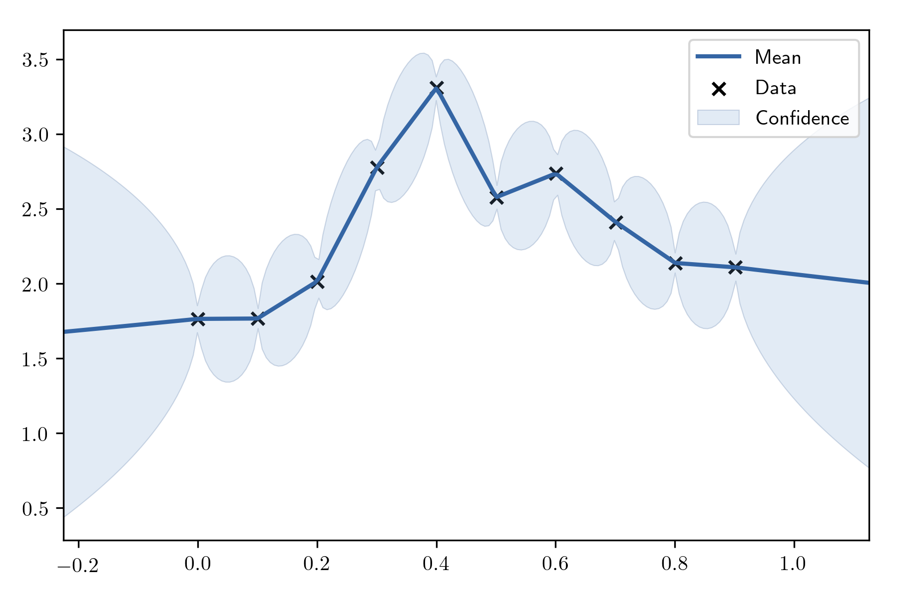{ width=55% }
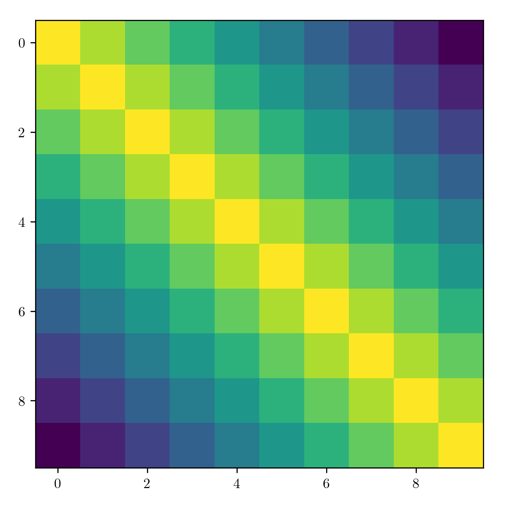{ width=36% }

# A time series example: 100 data points

- When we observe until $t=10.0$:

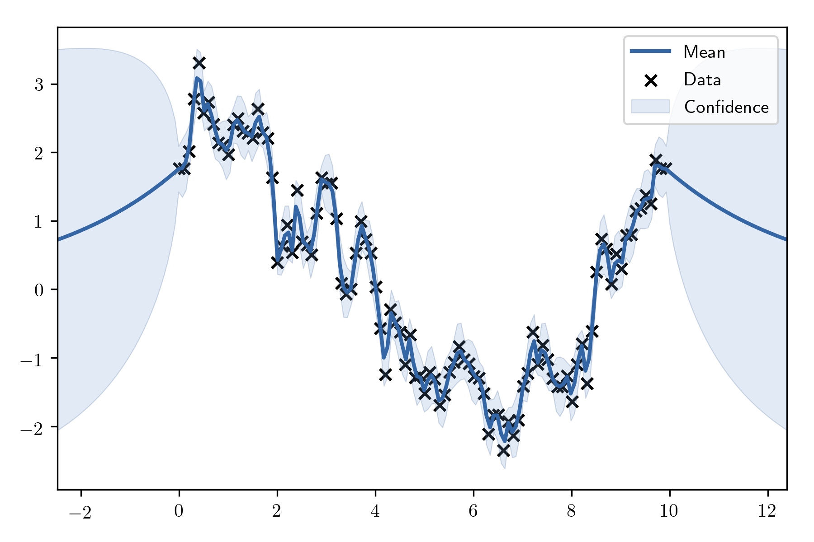{ width=55% }
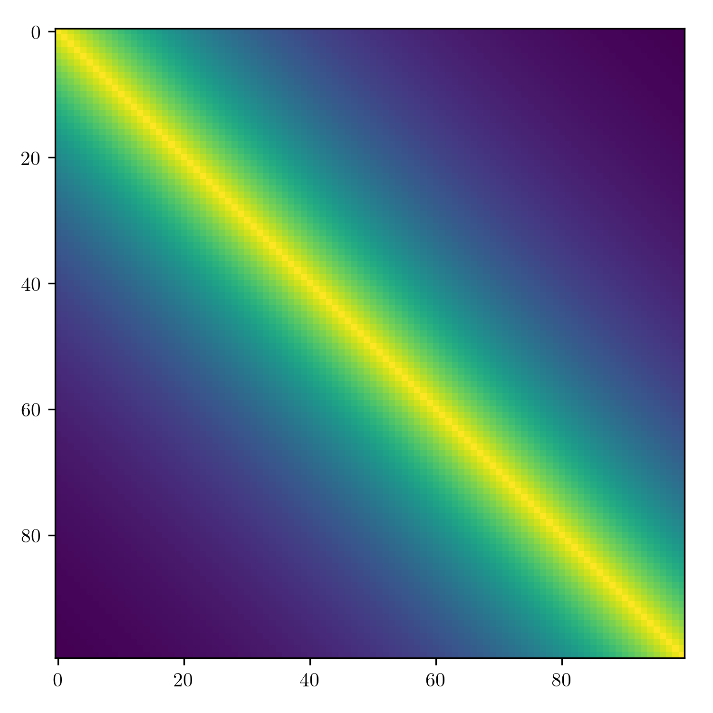{ width=36% }

# A time series example: 1000 data points

- When we observe until $t=100.0$:

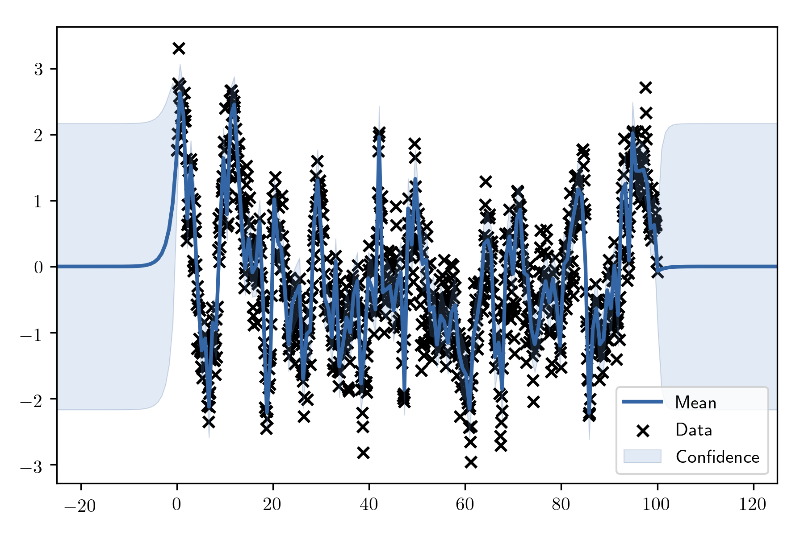{ width=55% }
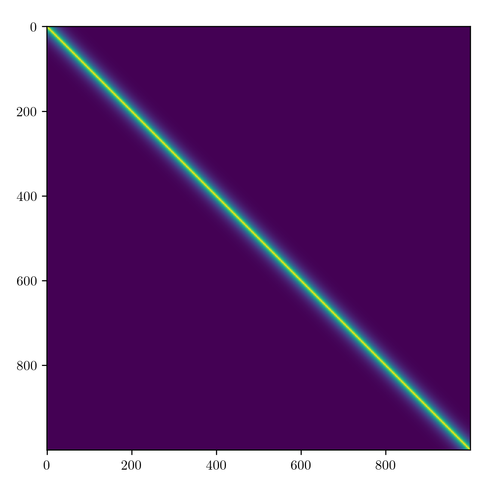{ width=36% }

# Banded precision matrix

- For the kernels like the Matern family, the precision matrix is banded.

- For example, given a Matern$\frac{1}{2}$ or known as exponential kernel: $k(x, x') = \sigma^2\exp(-\frac{|x-x'|}{l^2})$.

![This slide is taken from Nicolas Durrande [-@DurrandeEtAl2019]](./diagrams/banded_precision_matrix.png){ width=70% }

# Closed form precision matrix

- The precision matrix of Matern kernels can be computed in closed form.

- The lower triangular matrix from the Cholesky decomposition of the precision matrix is banded as well.
$$
\log(\yV|\xM) = -\frac{1}{2}\log |2\pi(LL^\top)^{-1}| - \frac{1}{2}\tr{\yV\yV^\top L L^\top}
$$
where $L$ is the lower triangular matrix from the Cholesky decomposition of the precision matrix $Q$, $Q=L L^\top$.

- The computational complexity becomes $O(N)$.

# Other approximations

- deterministic/stochastic frequency approximation
- distributed approximation
- conjugate gradient methods for covariance matrix inversion

# Why GP?

- Why do we spend all these energy on speeding up GP?
- Only for a non-parametric regressor?
- What about fitting a neural network?

{ width=50% }

# What is the difference?

- The error bar!

{ width=45% }
{ width=45% }

# Can we learn an error bar with NN?

- Of course, we can. Let's add a likelihood to the neural network:
$$
p(y|x) = \gaussianDist{y}{f_\theta(x)}{\sigma^2}
$$
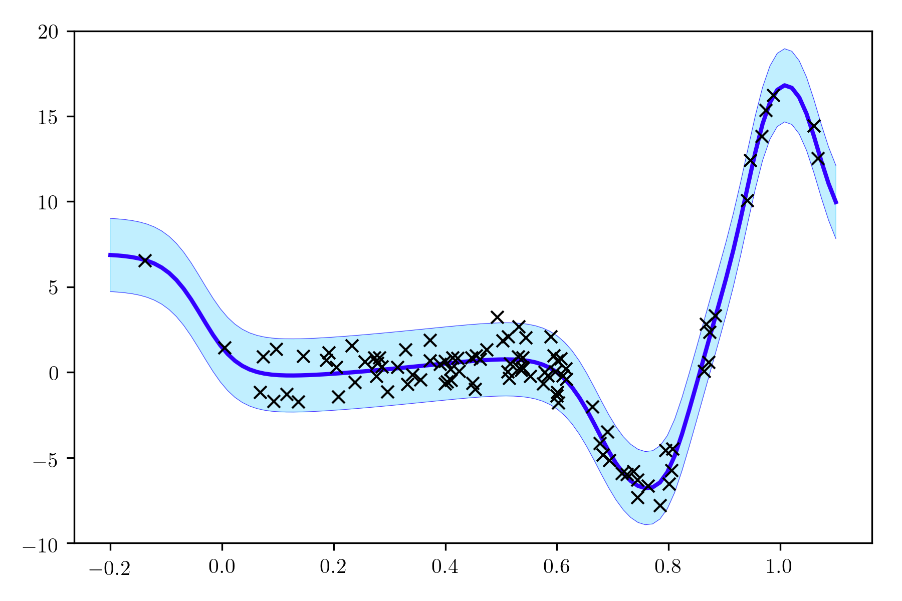{ width=45% }

- Now, we have an error bar for our neural network. Are they the same?

# Two types of uncertainty

- In our GP regression model, we have two "layers" of distributions:
$$
p(\yV| \fV) = \gaussianDist{\yV}{\fV}{\sigma^2 \I}, \quad p (\fV| \xM) = \gaussianDist{\fV}{0}{\K(\xM, \xM)}
$$

- Aleatoric uncertainty: the uncertainty about the noise in individual data points
- Epistemic uncertainty: the uncertainty in the model

$$
p(\theta|\mathcal{D}) = \frac{p(\mathcal{D}|\theta) p(\theta)}{p(\mathcal{D})}
$$

<!--
Too much technical details here

# A Bayesian linear model example

- It is easier to explain with a parametric model.

- A 1D quadratic regression example:
$$
p(\yV| \xV, \wV) = \gaussianDist{\yV}{\Psi\wV}{\sigma^2 \I}, \quad p (\wV) = \gaussianDist{\wV}{0}{\I}
$$
where $\Psi \in \R^{N \times 3}$ is the feature matrx:
$$
\Psi = \begin{bmatrix}
x_1^2& x_1& 1 \\
\vdots& \vdots& \vdots\\
x_N^2& x_N& 1
\end{bmatrix},
$$
and $\wV \in \R^3$ is the vector representing the coefficients of the quadratic equation.
-->

# Automated decision making

- Under the model assumption, the epistemic uncertainty allows us to know what the model *does not* know.

- This enables us to trade-off among different choices with limited information.

- Example: Bayesian optimization
$$
x^* = \arg \min_x f(x)
$$

# Bayesian optimization

A surrogate model guided search

{ width=50% }

# Possibility represented by uncertainty

{ width=50% }

# Balance exploitation and exploration

- **Exploitation**: Evaluate at the known best location will return the minimal value so far, but we learn nothing new.

- **Exploration**: Improve the understanding of the objective function, but may not be better than the current minimum.

{ width=30% }

# Acquisition function

- Formulate the policy of the exploitation and exploration tradeoff.

- The utility function about improvement:
$$
u(f) = \max(0, f' - f)
$$

- The expected improvement under our surrogate model:
$$
\begin{aligned}
a_{\text{EI}}(x) =& \int u(f) p(f|x, \mathcal{D}) \text{d}f \\
=& \int \max(0, f' - f) \gaussianDist{f}{m(x)}{c(x)} \text{d}f
\end{aligned}
$$

# A BO algorithm

Loop of Bayesian optimization:

1. Evaluate the objective function.
2. Update the surrogate model.
3. Select to the next location according to the acquisition function.

# BO Example

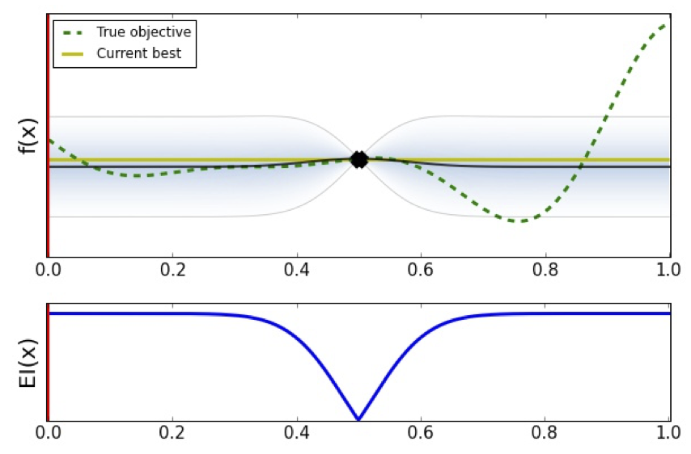{ width=60% }

# BO Example

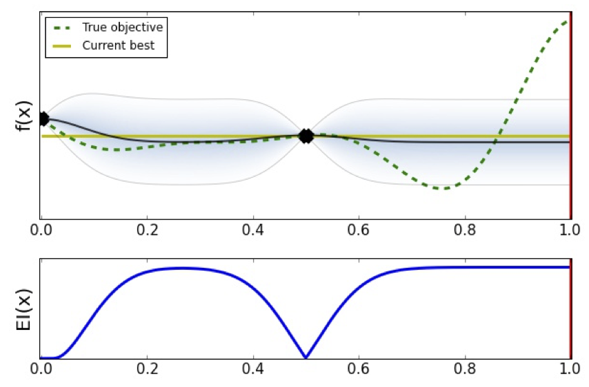{ width=60% }

# BO Example

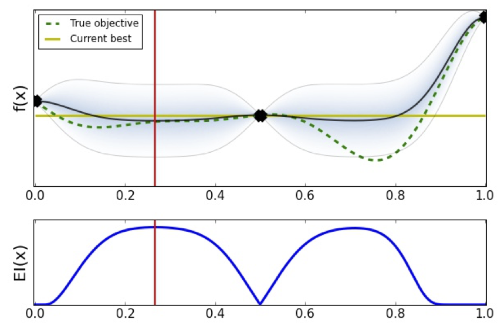{ width=60% }

# BO Example

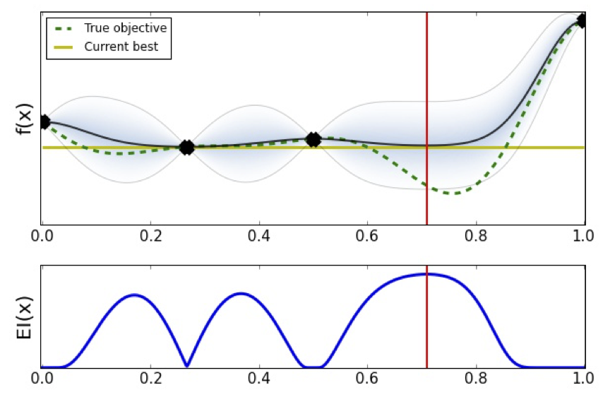{ width=60% }

# BO Example

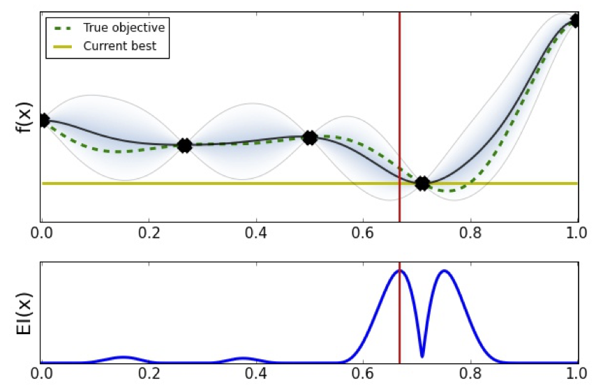{ width=60% }

# BO Example

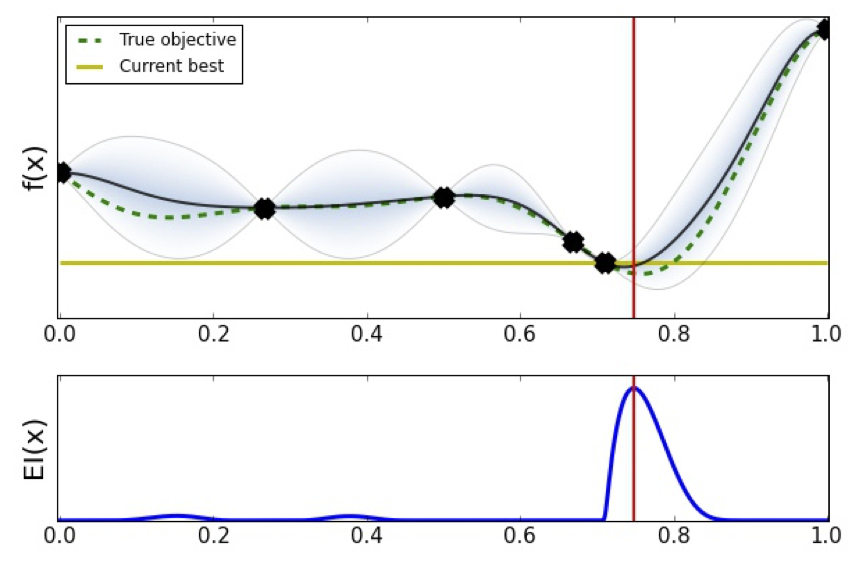{ width=60% }

# BO Example

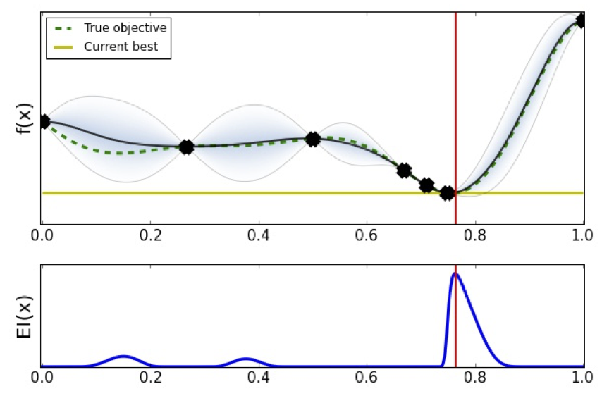{ width=60% }

# BO Example

{ width=60% }

# Challenges in Bayesian Optimization

- Optimizing the acquisition may be hard.

- With a high dimensional search problem, surrogate modeling becomes hard.  

- Structured inputs can be hard to handle.

- Non-stationarity of an objective function

- Model mismatch

- Unknown safety constraints

- Warm-starting

#
- Thank you!

# Lab session

- Please download the Jupyter notebook for the lab session from the following link:

[http://gpss.cc/gpss18/labs/GPSS_Lab3_2018.ipynb](http://gpss.cc/gpss18/labs/GPSS_Lab3_2018.ipynb)

# References {.allowframebreaks}
